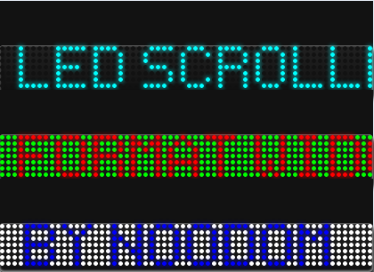
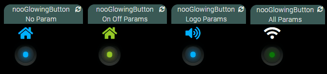
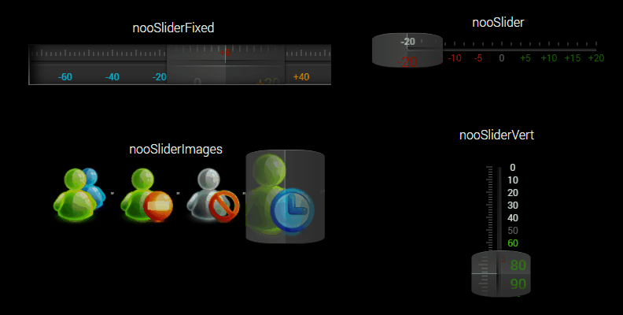
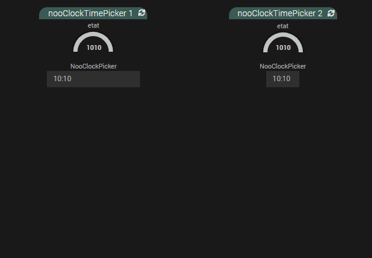
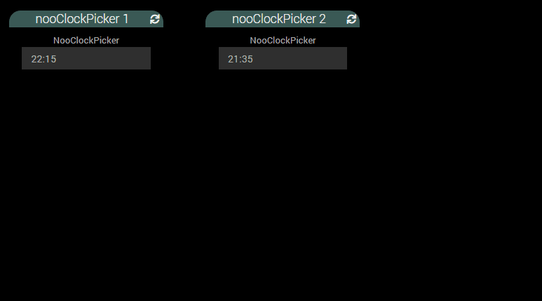
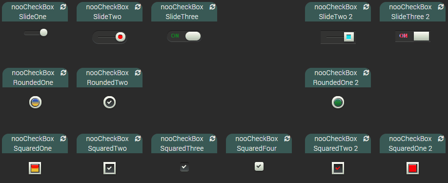
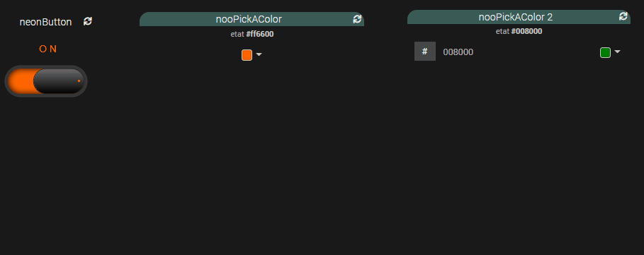

# jeedom_widgets

Développements de widgets pour Jeedom

## Liste des widgets

### Widget [nooLedScroller](./nooLedScroller) : à récupérer sous /jeedom_widgets/nooLedScroller/cmd.info.string.nooLedScroller.html

- voir l'installation dans [README.md](./nooLedScroller/README.md)

 

### Widget [nooCircleProgress](./nooCircleProgress) : à récupérer sous /jeedom_widgets/nooCircleProgress/cmd.info.numeric.nooCircleProgress.html

- voir l'installation dans [README.md](./nooCircleProgress/README.md)

 

### Widget [nooNeonButton](./nooNeonButton) : à récupérer sous /jeedom_widgets/nooNeonButton/cmd.action.other.nooNeonButton.html

- voir l'installation dans [README.md](./nooNeonButton/README.md)

 

### Widget [nooGlowingButton](./nooGlowingButton) : à récupérer sous /jeedom_widgets/nooGlowingButton/cmd.action.other.nooGlowingButton.html

- voir l'installation dans [README.md](./nooGlowingButton/README.md)

 

### Widget [nooSlider](./nooSlider) : à récupérer sous /jeedom_widgets/nooSlider/cmd.action.other.nooSlider.html

- voir l'installation dans [README.md](./nooSlider/README.md)

 

### Widget [nooClockPicker](./nooClockPicker) : à récupérer sous /jeedom_widgets/nooClockPicker/cmd.action.slider.nooClockPicker.html

- voir l'installation dans [README.md](./nooClockPicker/README.md)

 

### Widget [nooClockTimePicker](./nooClockTimePicker) : à récupérer sous /jeedom_widgets/nooClockTimePicker/cmd.action.slider.nooClockTimePicker.html

- voir l'installation dans [README.md](./nooClockTimePicker/README.md)

 

### Widget [nooCheckBox](./nooCheckBox) : à récupérer sous /jeedom_widgets/nooCheckBox/cmd.action.other.nooCheckBox.html

- voir l'installation dans [README.md](./nooCheckBox/README.md)

 

### Widget [nooPickAColor](./nooPickAColor) : à récupérer sous /jeedom_widgets/nooPickAColor/cmd.action.color.nooPickAColor.html

- voir l'installation dans [README.md](./nooPickAColor/README.md)

 
