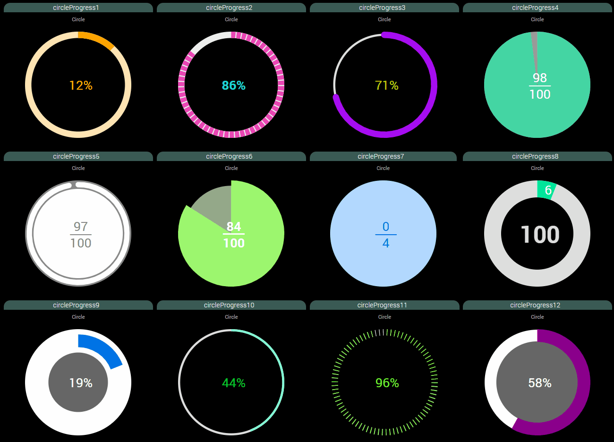
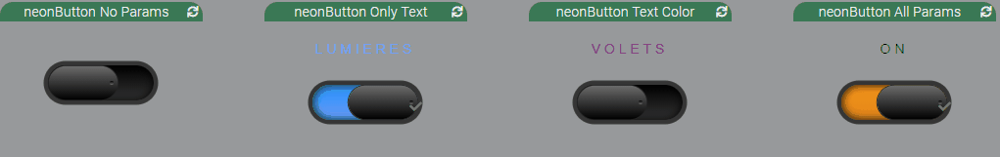

# jeedom_widgets

Développements de widgets pour Jeedom

## Liste des widgets

### Widget [V4 led Scroller](./ledScroller/V4) : à récupérer sous /jeedom_widgets/ledScroller/V4/index.html

	- voir l'installation dans /ledScroller/V4/README.md

 

### Widget [circleProgress](./circleProgress) : à récupérer sous /jeedom_widgets/circleProgress/cmd.info.numeric.circleProgress.html

	- voir l'installation dans /circleProgress/README.md

 

### Widget [neonButton](./neonButton) : à récupérer sous /jeedom_widgets/neonButton/cmd.action.other.neonButton.html

	- voir l'installation dans /neonButton/README.md

 

### Widget [nooGlowingButton](./nooGlowingButton) : à récupérer sous /jeedom_widgets/nooGlowingButton/cmd.action.other.nooGlowingButton.html

	- voir l'installation dans /nooGlowingButton/README.md

 

### Widget [nooSlider](./nooSlider) : à récupérer sous /jeedom_widgets/nooSlider/cmd.action.other.nooSlider.html

	- voir l'installation dans /nooSlider/README.md

 

### Widget [nooClockPicker](./nooClockPicker) : à récupérer sous /jeedom_widgets/nooClockPicker/cmd.action.slider.nooClockPicker.html

	- voir l'installation dans /nooClockPicker/README.md

 

### Widget [nooClockTimePicker](./nooClockTimePicker) : à récupérer sous /jeedom_widgets/nooClockTimePicker/cmd.action.slider.nooClockTimePicker.html

	- voir l'installation dans /nooClockTimePicker/README.md

 

### Widget [nooCheckBox](./nooCheckBox) : à récupérer sous /jeedom_widgets/nooCheckBox/cmd.action.other.nooCheckBox.html

	- voir l'installation dans /nooCheckBox/README.md

 
