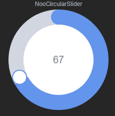

# Widgets Jeedom

Développements de widgets pour Jeedom

## :boom: [Installation automatique](./installation) d'un widget noodom à l'aide d'un scénario créé automatiquement

Cette installation permet de créer les différents widgets ci-dessous automatiquement à partir d'un simple scénario.

## Liste des widgets

### :boom: Widget [nooImgProgress](./nooImgProgress) :
- à récupérer sous [./nooImgProgress/cmd.info.numeric.nooImgProgress.html](./nooImgProgress/cmd.info.numeric.nooImgProgress.html)

- voir l'installation dans [README.md](./nooImgProgress/README.md)

 

### :boom: Widget [nooChart](./nooChart) :
- à récupérer sous [./nooChart/cmd.info.numeric.nooChart.html](./nooChart/cmd.info.numeric.nooChart.html)

- voir l'installation dans [README.md](./nooChart/README.md)

 

### :boom: Widget [nooLedScroller](./nooLedScroller) :
- à récupérer sous [./nooLedScroller/cmd.info.string.nooLedScroller.html](./nooLedScroller/cmd.info.string.nooLedScroller.html)
- voir l'installation dans [README.md](./nooLedScroller/README.md)

 

### :boom: Widget [nooCircleProgress](./nooCircleProgress) :
- à récupérer sous [./nooCircleProgress/cmd.info.numeric.nooCircleProgress.html](./nooCircleProgress/cmd.info.numeric.nooCircleProgress.html)

- voir l'installation dans [README.md](./nooCircleProgress/README.md)

 

### :boom: Widget [nooNeonButton](./nooNeonButton) :
- à récupérer sous [./nooNeonButton/cmd.action.other.nooNeonButton.html](./nooNeonButton/cmd.action.other.nooNeonButton.html)

- voir l'installation dans [README.md](./nooNeonButton/README.md)

 

### :boom: Widget [nooGlowingButton](./nooGlowingButton) :
- à récupérer sous [./nooGlowingButton/cmd.action.other.nooGlowingButton.html](./nooGlowingButton/cmd.action.other.nooGlowingButton.html)
- voir l'installation dans [README.md](./nooGlowingButton/README.md)

 

### :boom: Widget [nooSlider](./nooSlider) :
- à récupérer sous [./nooSlider/cmd.action.slider.nooSlider.html](./nooSlider/cmd.action.slider.nooSlider.html)
- voir l'installation dans [README.md](./nooSlider/README.md)

 

### :boom: Widget [nooCircularSlider](./nooCircularSlider) :
- à récupérer sous [./nooCircularSlider/cmd.action.slider.nooCircularSlider.html](./nooCircularSlider/cmd.action.slider.nooCircularSlider.html)
- voir l'installation dans [README.md](./nooCircularSlider/README.md)

 

### :boom: Widget [nooClockPicker](./nooClockPicker) :
- à récupérer sous [./nooClockPicker/cmd.action.slider.nooClockPicker.html](./nooClockPicker/cmd.action.slider.nooClockPicker.html)
- voir l'installation dans [README.md](./nooClockPicker/README.md)

 

### :boom: Widget [nooClockTimePicker](./nooClockTimePicker) :
- à récupérer sous [./nooClockTimePicker/cmd.action.slider.nooClockTimePicker.html](./nooClockTimePicker/cmd.action.slider.nooClockTimePicker.html)
- voir l'installation dans [README.md](./nooClockTimePicker/README.md)

 

### :boom: Widget [nooCheckBox](./nooCheckBox) :
- à récupérer sous [./nooCheckBox/cmd.action.other.nooCheckBox.html](./nooCheckBox/cmd.action.other.nooCheckBox.html)
- voir l'installation dans [README.md](./nooCheckBox/README.md)

 

### :boom: Widget [nooPickAColor](./nooPickAColor) :
- à récupérer sous [./nooPickAColor/cmd.action.color.nooPickAColor.html](./nooPickAColor/cmd.action.color.nooPickAColor.html)
- voir l'installation dans [README.md](./nooPickAColor/README.md)

 
