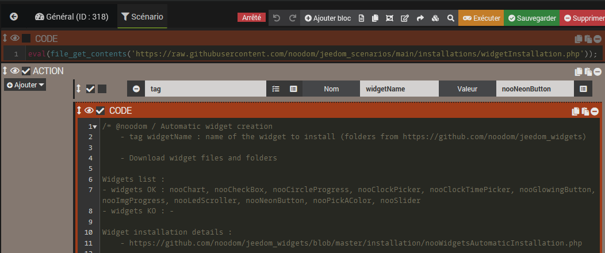

Vous trouverez ci-dessous la méthode d'installation automatique de mes différents widgets proposés 

# Installation automatique d'un widget noodom à l'aide d'un scénario créé automatiquement

1️⃣ Créer un scénario

2️⃣ Ajouter un bloc-code avec le contenu suivant, sauvegarder le scénario et l'exécuter :

`eval(file_get_contents('https://raw.githubusercontent.com/noodom/jeedom_scenarios/main/installations/widgetInstallation.php'));`

(code disponible ))

3️⃣ Rafraichir le scénario et on retrouve le scénario de génération automatique dans ce même scénario

4️⃣ Renseigner les tags `widgetName` (nom du widget à générer) selon le widget à générer et exécuter à nouveau le scénario

5️⃣ Le widget précisé est automatiquement généré dans la liste des widgets disponibles depuis Jeedom !

> - Pour générer un nouveau widget, seules les étapes 4️⃣ et 5️⃣ sont nécessaires (les 3 premières étapes sont seulement utiles pour générer le scénario de génération de widgets ou de mise à jour de ce scénario)
