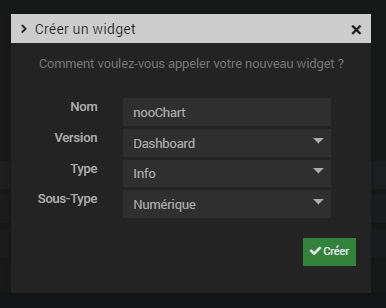
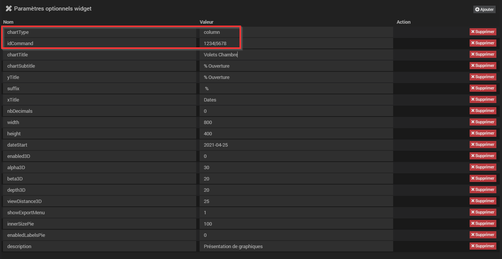

# Widget nooChart

## A récupérer sous /jeedom_widgets/nooChart/cmd.info.numeric.nooChart.html

## Création du widget

Depuis le plugin Pimp My Jeedom :

- Depuis l'onglet 'Général', sélectionner le bouton 'Ajouter un Widget Tiers'
- Saisir le nom nooChart, la version Dashboard, le type Info et le Sous-Type Numérique puis valider avec le bouton 'Créer'

- Dans la zone de texte 'Edition', coller le code du fichier cmd.info.numeric.nooChart.html
- Sélectionner le bouton 'Sauvegarder'

## Création d'un virtuel avec commande info

- Créer un virtuel depuis le plugin Virtuel (Plugin -> Programmation -> Virtuel)
- Dans ce virtuel, ajouter une commande info et de sous-type Numérique

## association du widget à la commande info

Depuis le plugin Pimp My Jeedom :

- Sélectionner le bouton 'Appliquer sur'
- Cocher les commandes de type Infos souhaitées (par exemple, la commande info du virtuel créé ci-dessus)
- Enregistrer les commandes avec le bouton 'Valider'

- La liste des commandes associées au widget sont visibles dans la partie 'Commandes liées'
- Une prévisualisation basée sur le premier virtuel associé est visible

## (facultatif) Paramètres de la commande associée au widget

La saisie des paramètres suivants sont facultatif excepté le paramètre 'idCommand' : il correspond à la liste des ids qu'on souhaite afficher dasn les graphiques.
- Pour l'affichage d'un seul graphique, le format est le suivant : 1234
- Pour l'affichage de plusieurs graphiques, le format est le suivant : 1234|5678 où on affiche alors les 2 courbes de chaque commande 1234 et 5678 (Important : ces commandes doivent être historisées pour avoir du contenu à afficher)

De nombreux paramètres sont possibles pour personnaliser les virtuels et obtenir des rendus très différents

        chartType : (par défaut 'line',valeurs possibles : line : ligne, column : colonnes, area : aire, pie : camembert, bar : barres horizontales)
        width : largeur du graphique (par défaut 300)
        height : hauteur du graphique (par défaut 500)
        chartTitle : titre du graphique (vide par défaut)
        chartSubtitle : sous-titre du graphique (vide par défaut)
        xTitle : légende de l'axe horizontal (vide par défaut)
        yTitle : légende de l'axe vertical (vide par défaut)
        yMin : valeur minimale de l'axe vertical (par défaut 0)
        yMax : = valeur maximale de l'axe vertical (par défaut 100)
        dateStart : date de début d'affichage au format 'YYYY-MM-JJ' (par défaut "2020-01-01")
        dateEnd : date de fin d'affichage (par défaut date courante)
        addSerieLabel : texte à afficher dans la popup affichée à chaque création de série de données (vide par défaut et donc pas d'affichage de popup)
        addSerialColor : couleur du texte addSerieLabel (par défaut '#FFFFFF')
        addSerialBackgroundColor : couleur de fond du texte addSerieLabel (par défaut '#FFFFFF')
        suffix : chaine de caractères à ajouter aux valeurs (vide par défaut, par exemple ' %', ' °')
        nbDecimals : nombre de décimales affichées pour les valeurs affichées (par défaut 2)

        allowPointSelectPie : (actif seulement pour chartType='pie') autorisation de sélectionner un élément du camembert (par défaut 1, valeurs possibles : 0 : non, 1: oui)
        depthPie : (actif seulement si enabled3D est à 1) épaisseur du camembert (par défaut 35),
        innerSizePie : largeur du trou à l'intérieur du camembert (par défaut 0),
        enabledLabelsPie : affichage du libellé relié à chaque partie du camembert (par défaut 0, valeurs possibles : 0 : non, 1: oui)

        enabled3D : active la visualisation 3D (par défaut 0, valeurs possibles : 0 : non, 1: oui)
        alpha3D : (actif seulement si enabled3D est à 1) angle d'affichage pour la vue de haut (par défaut à 20)
        beta3D : (actif seulement si enabled3D est à 1) angle d'affichage horizontal (par défaut à 20, valeurs cohérentes : -45 à 45)
        depth3D : (actif seulement si enabled3D est à 1) distance du graphique par rapport au fond (par défaut à 20)
        viewDistance3D : (par défaut 25)
        showExportMenu : affiche le bouton permettant d'exporter l'affichage (png, jpeg, pdf, ..), par défaut à 0, valeurs possibles : 0 : non, 1: oui
		description : texte de description à ajouter en bas du graphique (vide par défaut)
			

## Ajout dans un Design

	- Depuis un Design, ajouter l'équipement ou le virtuel et suivez les étapes suivantes :
		- Clic droit, Sélectionnez 'Edition'
		- Clic droit, puis sélectionnez 'Ajouter équipement'
		- Sélectionner l'équipement souhaité
		- Sélectionner Valider
		- Rafraichir la page : le widget nooChart est visible dans le Design
