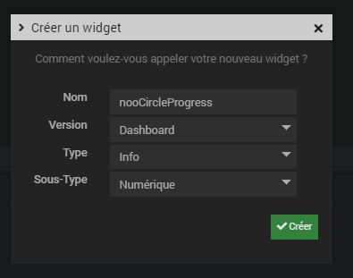
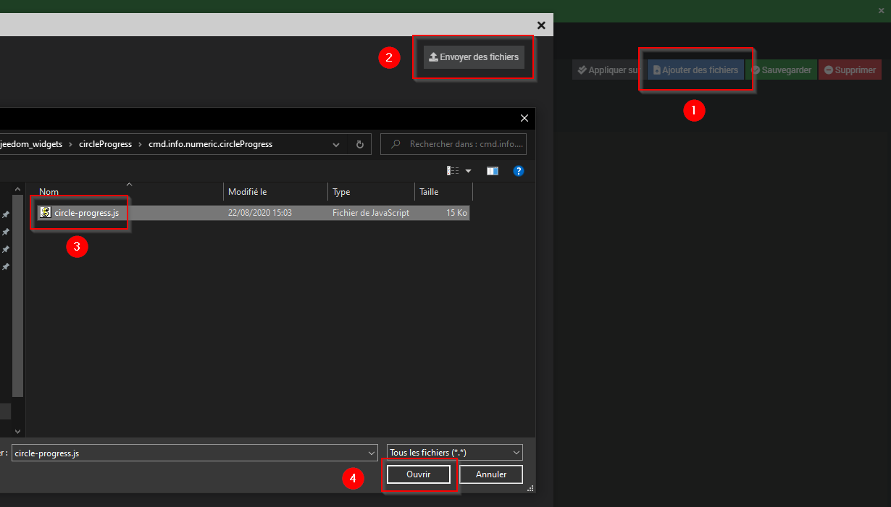

# Widget nooCircleProgress

## A récupérer sous /jeedom_widgets/nooCircleProgress/cmd.info.numeric.nooCircleProgress.html

## Création du widget

Depuis le plugin Pimp My Jeedom :

- Depuis l'onglet 'Général', sélectionner le bouton 'Ajouter un Widget Tiers'
- Saisir le nom nooCircleProgress, la version Dashboard, le type Info et le Sous-Type Numérique puis valider avec le bouton 'Créer'

- Dans la zone de texte 'Edition', coller le code du fichier cmd.info.numeric.nooCircleProgress.html
- Sélectionner le bouton 'Ajouter des fichiers', puis 'Envoyer des fichiers', ajouter le fichier /cmd.info.numeric.nooCircleProgress/circle-progress.js et fermer la fenêtre

- Sélectionner le bouton 'Sauvegarder'

## (facultatif) Création d'un virtuel avec commande info

- Si vous souhaitez associer le widget à une commande existante, cette étape n'est pas nécessaire
- Sinon, si vous souhaitez créer un nouveau nooCircleProgress :
	- Créer un virtuel depuis le plugin Virtuel (Plugin -> Programmation -> Virtuel)
	- Dans ce virtuel, ajouter une commande info et de sous-type Numérique
		- Ce champ texte peut être modifié par scénario avec la commande event : la mise à jour de la valeur sera alors immédiate sur le design

## association du widget à la commande info

Depuis le plugin Pimp My Jeedom :

- Sélectionner le bouton 'Appliquer sur'
- Cocher les commandes de type Infos souhaitées
- Enregistrer les commandes avec le bouton 'Valider'

- La liste des commandes associées au widget sont visibles dans la partie 'Commandes liées'
- Une prévisualisation basée sur le premier virtuel associé est visible

## (facultatif) Paramètres de la commande associée au widget

De nombreux paramètres sont possibles pour personnaliser les virtuels et obtenir des rendus très différents

	style : choix parmi une liste de paramétrages prédéfinis des champs ci-dessous (valeur de 1 à 13)
	useStyle : choix d'utilisation des styles prédéfinis (par défaut 'only_style', valeurs possibles : no_style,only_style,style_with_options)

	min : valeur minimum autorisée (0 par défaut)
	max : valeur maximum autorisée (100 par défaut)
	angleDebut : Angle de début d'affichage (0 par défaut)
	ordreInverse : 0=non, 1=oui (0 par défaut)
	taille : hauteur et largeur (250px par défaut)
	couleurFond : couleur de fond du widget (transparent par défaut)
	uniteChamp : unité à afficher avec la valeur dans le cercle si précisé (ex ° pour afficher '22°')
	format : format prédéfini d'affichage (valeurs possibles : horizontal, vertical, percent, value, valueOnCircle, none)
	dureeAnimation : durée de l'animation de remplissage de la valeur dans le cercle au chargement

	largeurValeur : largeur de la partie du cercle représentant la valeur
	couleurValeur : couleur de la partie du cercle représentant la valeur
	ecartValeur :  permet de mettre des pointillés (taille point et espace, ex : '4 1') pour la partie du cercle représentant la valeur
	offsetValeur : décalage de la partie du cercle représentant la valeur
	arrondiValeur :  de la partie du cercle représentant la valeur
	largeurCercle :  largeur du cercle de fond complet
	couleurCercle : couleur du tour du cercle complet
	couleurFondCercle : couleur de remplissage de fond du cercle
	ecartCercle :  permet de mettre des pointillés (taille point et espace, ex : '4 1') pour le cercle complet
	offsetCercle : décalage du cercle de fond complet
	nomFonteTexte : nom de la fonte du texte
	renduFonteTexte : type de fonte du texte
	tailleFonteTexte : taille du texte
	couleurTexte : couleur du texte

	=> 3 possiblités pour paramétrer le rendu du widget :
		- ajouter seulement le paramètre style avec une valeur de 1 à 13 : prédéfinit les autres paramètres
		- ajouter les paramètres de son choix pour créer son propre affichage de widget
		- ajouter le paramètre style et modifier l'apparence en ajoutant quelques paramètres pour modifier le rendu final du style ajouté
			

## Ajout dans un Design

	- Depuis un Design, ajouter l'équipement ou le virtuel et suivez les étapes suivantes :
		- Clic droit, Sélectionnez 'Edition'
		- Clic droit, puis sélectionnez 'Ajouter équipement'
		- Sélectionner l'équipement souhaité
		- Sélectionner Valider
		- Rafraichir la page : le widget nooCircleProgress est visible dans le Design
