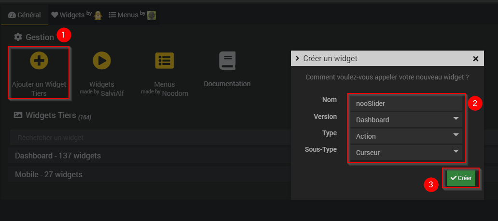

# Widget nooCircularSlider

## A récupérer sous /jeedom_widgets/nooCircularSlider/cmd.info.numeric.nooCircularSlider.html

## Création du widget

Depuis le plugin Pimp My Jeedom :

- Depuis l'onglet 'Général', sélectionner le bouton 'Ajouter un Widget Tiers'
- Saisir le nom nooCircularSlider, la version Dashboard, le type Action et le Sous-Type Curseur puis valider avec le bouton 'Créer'

- Dans la zone de texte 'Edition', coller le code du fichier cmd.info.numeric.nooCircularSlider.html

- Sélectionner le bouton 'Ajouter des fichiers', puis 'Envoyer des fichiers', ajouter le fichier /cmd.info.numeric.nooCircularSlider/nooCircularSlider.js et fermer la fenêtre
- Si nécessaire, ajouter les images des virtuels associés au widget avec le même principe.

- Sélectionner le bouton 'Sauvegarder'

>**Note** : Le widget peut évidemment être créé de façon classique comme un widget tiers sans le plugin Pimp my Jeedom
> - Sélectionner le menu Outil -> Widgets,
> - Sélectionner Code, puis Nouveau
> - Saisir le nom nooCircularSlider, la version Dashboard, le type Action et le Sous-Type Curseur puis valider avec le bouton 'Créer'
> - Dans la zone de texte 'Edition', coller le code du fichier cmd.action.other.nooCircularSlider.html
> - Sélectionner le bouton 'Sauvegarder'

## (facultatif) Création d'un virtuel avec commande info et commande action Curseur

- Si vous souhaitez associer le widget à une commande existante, cette étape n'est pas nécessaire
- Sinon, si vous souhaitez créer un nouveau nooCircularSlider :
	- Créer un virtuel depuis le plugin Virtuel (Plugin -> Programmation -> Virtuel)
	- Dans ce virtuel, ajouter une commande info et de sous-type Numérique
		- Ce champ texte peut être modifié par scénario avec la commande event : la mise à jour de la valeur sera alors immédiate sur le design
	- Dans le virtuel, ajouter une commande action et de sous-type Curseur
  - Associer la commande info à cette commande action

## association du widget à la commande action

Depuis le plugin Pimp My Jeedom :

- Sélectionner le bouton 'Appliquer sur'
- Cocher les commandes de type Action souhaitées
- Enregistrer les commandes avec le bouton 'Valider'

- La liste des commandes associées au widget sont visibles dans la partie 'Commandes liées'
- Une prévisualisation basée sur le premier virtuel associé est visible

## (facultatif) Paramètres de la commande associée au widget

De nombreux paramètres sont possibles pour personnaliser les virtuels et obtenir des rendus très différents

            min (KO) : valeur minimale du slider (0 par défaut)
            max : valeur maximale du slider (100 par défaut)
            step : pas de défilement (1 par défaut)
            size : hauteur et largeur (200px par défaut)
            valueColor : couleur de la valeur (grey par défaut)
            valueCircleColor : couleur de la partie du cercle représentant la valeur (cornflowerblue par défaut)
            circleColor : couleur du tour du cercle complet (hsl(219, 20%, 85%) par défaut)
            backgroundCircleColor : couleur de remplissage de fond du cercle (#FFF par défaut)
			

## Ajout dans un Design

	- Depuis un Design, ajouter l'équipement ou le virtuel et suivez les étapes suivantes :
		- Clic droit, Sélectionnez 'Edition'
		- Clic droit, puis sélectionnez 'Ajouter équipement'
		- Sélectionner l'équipement souhaité
		- Sélectionner Valider
		- Rafraichir la page : le widget nooCircularSlider est visible dans le Design
		
Pensez au café pour les nuits blanches de codage ;) https://www.paypal.com/cgi-bin/webscr?cmd=_donations&business=noodom.fr%40gmail.com&currency_code=EUR&source=url
