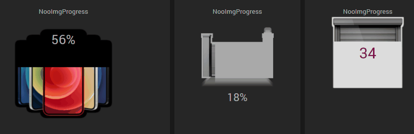
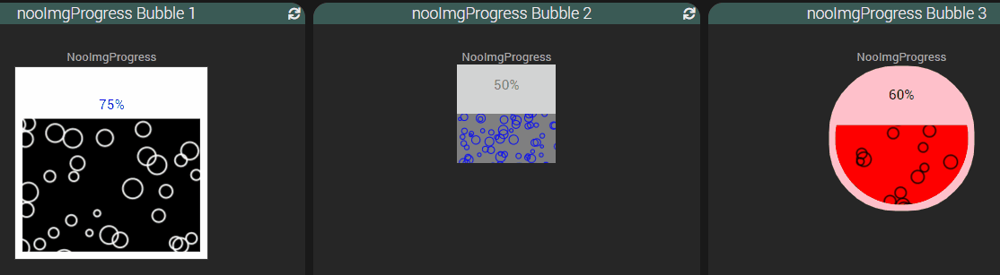
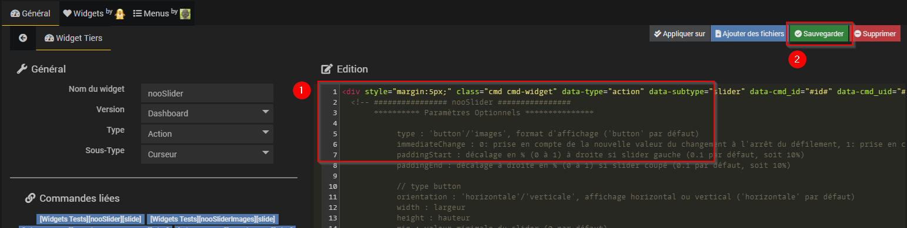

# Widget nooImgProgress

## A récupérer sous /jeedom_widgets/nooImgProgress/cmd.info.numeric.nooImgProgress.html

## Création du widget

Depuis le plugin Pimp My Jeedom :

- Depuis l'onglet 'Général', sélectionner le bouton 'Ajouter un Widget Tiers'
- Saisir le nom nooImgProgress, la version Dashboard, le type Info et le Sous-Type Numérique puis valider avec le bouton 'Créer'

- Dans la zone de texte 'Edition', coller le code du fichier cmd.info.numeric.nooImgProgress.html

- Sélectionner le bouton 'Ajouter des fichiers', puis 'Envoyer des fichiers', ajouter les fichiers /cmd.info.numeric.nooImgProgress/loading-bar.min.js, /cmd.info.numeric.nooImgProgress/loading-bar.min.css, /cmd.info.numeric.nooImgProgress/default.png et fermer la fenêtre

- Sélectionner le bouton 'Sauvegarder'

>**Note** : Le widget peut évidemment être créé de façon classique comme un widget tiers sans le plugin Pimp my Jeedom
> - Sélectionner le menu Outil -> Widgets,
> - Sélectionner Code, puis Nouveau
> - Saisir le nom nooImgProgress, la version Dashboard, le type Info et le Sous-Type Numérique puis valider avec le bouton 'Créer'
> - Dans la zone de texte 'Edition', coller le code du fichier cmd.info.numeric.nooImgProgress.html
> - Sélectionner le bouton 'Sauvegarder'
> - Recopier le répertoire /cmd.info.numeric.nooImgProgress sous html/data/customTemplates/dashboard

## (facultatif) Création d'un virtuel avec commande Info et commande Info Numérique

- Si vous souhaitez associer le widget à une commande existante, cette étape n'est pas nécessaire
- Sinon, si vous souhaitez créer un nouveau nooImgProgress :
	- Créer un virtuel depuis le plugin Virtuel (Plugin -> Programmation -> Virtuel)
	- Dans ce virtuel, ajouter une commande Info et de sous-type Numérique
		- Ce champ texte peut être modifié par scénario avec la commande event : la mise à jour de la valeur sera alors immédiate sur le design

## association du widget à la commande Info

Depuis le plugin Pimp My Jeedom :

- Sélectionner le bouton 'Appliquer sur'
- Cocher les commandes de type Info souhaitées
- Enregistrer les commandes avec le bouton 'Valider'

- La liste des commandes associées au widget est visible dans la partie 'Commandes liées'
- Une prévisualisation basée sur le premier virtuel associé est visible

## (facultatif) Paramètres de la commande associée au widget

De nombreux paramètres sont possibles pour personnaliser les virtuels et obtenir des rendus très différents

       animation (inactif) : affichage progressif sur changement de valeur (par défaut 1) 
       type : type d'affichage ('fill' : affichage par défaut 'fill', autre affichage possible, bulles :  'bubble')
       image : url de l'image à afficher au format png (par défaut 'data/customTemplates/dashboard/cmd.info.numeric.nooImgProgress/default.png')
       size : taille de l'image au format 'largeur,hauteur', ex : '200,100' (par défaut, taille de l'image avec la valeur '')
       direction : direction de remplissage de l'image ('btt' : bas vers haut, ''ttb' : haut vers bas, 'ltr' : gauche vers droite, 'rtl' : droite vers gauche), par défaut 'btt'
       precision : chiffres après la virgule : 0, 0.1, 0.01, ... (par défaut 0),
       backgroundColor : couleur de fond de l'image (par défaut '#ddd')
       backgroundExtrude : largeur de dépassement du fond autour de l'image (par défaut 3)
       unit : unité à ajouter à la valeur affichée, ex : '%' (par défaut '')
       min : valeur minimum autorisée (0 par défaut)
       max : valeur maximum autorisée (100 par défaut)
       duration : durée de l'animation sur changement de valeur en secondes (par défaut  1 / 0 : pas d'animation)
       labelTop : positionnement vertical du libellé de la valeur, ex : '-20px', '120%' (par défaut '50%')
       labelLeft : positionnement horizontal du libellé de la valeur, ex : '-20px', '120%' (par défaut '50%')
       labelColor : couleur du libellé de la valeur (par défaut '#fff')
       labelFontsize : taille du libellé de la valeur (par défaut '14px')

       bubbleBackGroundColor : couleur de fond des bulles (par défaut '#248')
       bubbleColor : couleur des bulles (par défaut '#fff')
       bubbleCount : nombre de bulles affichées sur la durée bubbleDuration (par défaut 50)
       bubbleDuration : durée d'affichage des bulles (par défaut 0 : pas de bulles)
       bubblePath : Format du conteneur des bulles (valeurs possibles : square : carré sans bordure, squareBorder : carré avec bordure, round/roundBorder : rond avec une bordure, par défaut : rond avec bordure)

## Ajout dans un Design

	- Depuis un Design, ajouter l'équipement ou le virtuel et suivez les étapes suivantes :
		- Clic droit, Sélectionnez 'Edition'
		- Clic droit, puis sélectionnez 'Ajouter équipement'
		- Sélectionner l'équipement souhaité
		- Sélectionner Valider
		- Rafraichir la page : le widget nooImgProgress est visible dans le Design
		
Pensez au café pour les nuits blanches de codage ;) https://www.paypal.com/cgi-bin/webscr?cmd=_donations&business=noodom.fr%40gmail.com&currency_code=EUR&source=url
