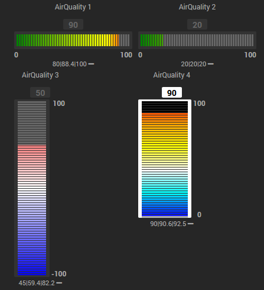

# Widget nooInfoGradientSlider

## A récupérer sous /jeedom_widgets/nooInfoGradientSlider/cmd.info.numeric.nooInfoGradientSlider.html

## Création du widget

Depuis le plugin Pimp My Jeedom :

- Depuis l'onglet 'Général', sélectionner le bouton 'Ajouter un Widget Tiers'
- Saisir le nom nooInfoGradientSlider, la version Dashboard, le type Info et le Sous-Type Numérique puis valider avec le bouton 'Créer'

- Dans la zone de texte 'Edition', coller le code du fichier cmd.info.numeric.nooInfoGradientSlider.html

- Sélectionner le bouton 'Sauvegarder'

> **Note** : Le widget peut évidemment être créé de façon classique comme un widget tiers sans le plugin Pimp my Jeedom
>
> - Sélectionner le menu Outil -> Widgets,
> - Sélectionner Code, puis Nouveau
> - Saisir le nom nooInfoGradientSlider, la version Dashboard, le type Info et le Sous-Type Numérique puis valider avec le bouton 'Créer'
> - Dans la zone de texte 'Edition', coller le code du fichier cmd.info.numeric.nooInfoGradientSlider.html
> - Sélectionner le bouton 'Sauvegarder'

## (facultatif) Création d'un virtuel avec commande Info et commande Info Numérique

- Si vous souhaitez associer le widget à une commande existante, cette étape n'est pas nécessaire
- Sinon, si vous souhaitez créer un nouveau nooInfoGradientSlider :
  - Créer un virtuel depuis le plugin Virtuel (Plugin -> Programmation -> Virtuel)
  - Dans ce virtuel, ajouter une commande Info et de sous-type Numérique
    - Ce champ texte peut être modifié par scénario avec la commande event : la mise à jour de la valeur sera alors immédiate sur le design

## association du widget à la commande Info

Depuis le plugin Pimp My Jeedom :

- Sélectionner le bouton 'Appliquer sur'
- Cocher les commandes de type Info souhaitées
- Enregistrer les commandes avec le bouton 'Valider'

- La liste des commandes associées au widget est visible dans la partie 'Commandes liées'
- Une prévisualisation basée sur le premier virtuel associé est visible

## (facultatif) Paramètres de la commande associée au widget

De nombreux paramètres sont possibles pour personnaliser les virtuels et obtenir des rendus très différents

        width : couleur de début du dégradé du bouton On ('#70a1ff' si non renseigné)
        height :  couleur de fin du dégradé du bouton On ('#1e90ff' si non renseigné)
        bgColor : couleur de début du dégradé du bouton Off ('#333' si non renseigné)
        bgPixelsOff :  couleur de fin du dégradé du bouton Off ('#000' si non renseigné)
        gradientValues : valeurs des dégradés de couleurs ('0|80|100' si non renseigné)
        gradientColors : couleur des pixels de fond ('green|yellow|red' si non renseigné)
        vertical : affichage vertical : '0' pour affichage horizontal, '1' pour affichage vertical('0' si non renseigné)

## Ajout dans un Design

    - Depuis un Design, ajouter l'équipement ou le virtuel et suivez les étapes suivantes :
    	- Clic droit, Sélectionnez 'Edition'
    	- Clic droit, puis sélectionnez 'Ajouter équipement'
    	- Sélectionner l'équipement souhaité
    	- Sélectionner Valider
    	- Rafraichir la page : le widget nooInfoGradientSlider est visible dans le Design

Pensez au café pour les nuits blanches de codage ;) https://www.paypal.com/cgi-bin/webscr?cmd=_donations&business=noodom.fr%40gmail.com&currency_code=EUR&source=url
