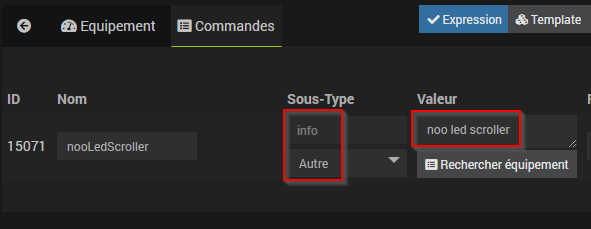
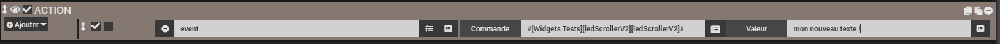
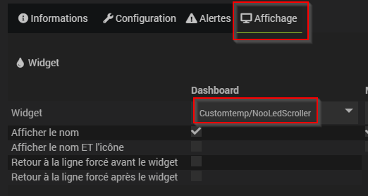
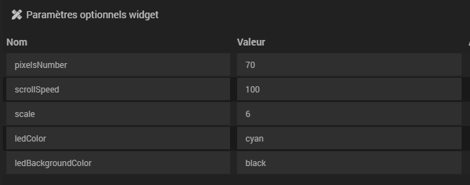

# Widget nooLedScroller

## A récupérer sous /jeedom_widgets/nooLedScroller/cmd.info.string.nooLedScroller.html

## Création du widget

- Depuis le plugin Pimp My Jeedom :
	- Depuis l'onglet 'Général', sélectionner le bouton 'Ajouter un Widget Tiers'
	- Saisir le nom nooLedScroller, la version Dashboard, le type Info et le Sous-Type Autre puis valider avec le bouton 'Créer'

- Depuis la page d'édition de widgets (Menu Outils -> Widget -> Code),
	- Sélectionner dashboard, puis sélectionner Nouveau
	- Dans les options, préciser Version:Dashboard, Type:Info, Sous-type:Autre et Nom:nooLedScroller
	- Sélectionner Créer pour valider
	- Dans la zone d'édition, coller le code du widget contenu dans cmd.info.string.nooLedScroller.html
	- Sélectionner Sauvegarder

## (facultatif) Création d'un virtuel avec commande info

- Si vous souhaitez associer le widget à une commande existante, cette étape n'est pas nécessaire
- Sinon, si vous souhaitez créer un nouveau led scroller :
	- Créer un virtuel depuis le plugin Virtuel (Plugin -> Programmation -> Virtuel)
	- Dans ce virtuel, ajouter une commande info et de sous-type Autre
		- Les caractères autorisés du champ texte sont :
			ABCDEFGHIJKLMNOPQRSTUVWXYZ1234567890°#|'€"/%-*+=?!:,.
		- Ce champ texte peut être modifié par scénario avec la commande event : la mise à jour du texte sera alors immédiate sur le design

## association du widget à la commande info

	- Depuis la commande info, sélectionner la roue dentée
	- Sélectionner l'onglet Affichage
	- Sélectionner CustomTemp/nooLedScroller dans la liste des widgets proposés pour Widget en mode Dashboard
	- Enregistrer
	
## (facultatif) Paramètres de la commande associée au widget

		ledColor = code couleur des leds allumées (par défaut #0ff)
		ledBackgroundColor = code couleur des leds de fond éteintes (par défaut #121212)
		scrollSpeed = vitesse de défilement, nombre de rafraichissements par seconde (par défaut 30)
		pixelsNumber = nombre de leds horizontaux (60 par défaut)
		scale = facteur multipliant la taille (par défaut 1)

## Ajout dans un design

	- Depuis un design, ajouter l'équipement ou le virtuelsuivez les étapes suivantes :
		- Clic droit, Sélectionnez 'Edition'
		- Clic droit, puis sélectionnez 'Ajouter équipement'
		- Sélectionner l'équipement souhaité
		- Sélectionner Valider
		- Rafraichir la page : le led Scroller est visible dans le design
