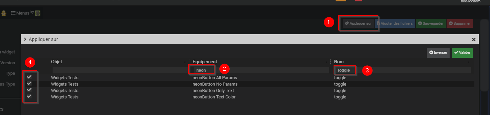

# Widget nooNeonButton

## A récupérer sous /jeedom_widgets/nooNeonButton/cmd.action.other.nooNeonButton.html

## Création du widget

Depuis le plugin Pimp My Jeedom :

- Depuis l'onglet 'Général', sélectionner le bouton 'Ajouter un Widget Tiers'
- Saisir le nom nooNeonButton, la version Dashboard, le type Action et le Sous-Type Défaut puis valider avec le bouton 'Créer'

- Dans la zone de texte 'Edition', coller le code du fichier cmd.action.other.nooNeonButton.html
- Sélectionner le bouton 'Sauvegarder'

## (facultatif) Création d'un virtuel avec commande action

- Si vous souhaitez associer le widget à une commande existante, cette étape n'est pas nécessaire
- Sinon, si vous souhaitez créer un nouveau nooNeonButton :
	- Créer un virtuel depuis le plugin Virtuel (Plugin -> Programmation -> Virtuel)
	- Ajouter une commande info Etat et de sous-type Binaire
  - Ajouter une commande action à associer à la commande info Etat
  - Saisir pour valeur 'not(#[monObjet][monNooNeonButton][Etat]#)'

## association du widget à la commande action

Depuis le plugin Pimp My Jeedom :

- Sélectionner le bouton 'Appliquer sur'
- Cocher les commandes de type Action souhaitées
- Enregistrer les commandes avec le bouton 'Valider'

- La liste des commandes associées au widget sont visibles dans la partie 'Commandes liées'
- Une prévisualisation basée sur le premier virtuel associé est visible

## (facultatif) Paramètres de la commande associée au widget

De nombreux paramètres sont possibles pour personnaliser les virtuels et obtenir des rendus différents

	backgroundColorFromOn : couleur de début du dégradé du bouton On ('#70a1ff' si non renseigné)
	backgroundColorToOn :  couleur de fin du dégradé du bouton On ('#1e90ff' si non renseigné)
	backgroundColorFromOff : couleur de début du dégradé du bouton Off ('#333' si non renseigné)
	backgroundColorToOff :  couleur de fin du dégradé du bouton Off ('#000' si non renseigné)
	colorTextOn : couleur du texte du bouton On (backgroundColorFromOn si non renseigné)
	colorTextOff : couleur du texte du bouton Off (colorTextOn si non renseigné, '#000' si colorTextOn non renseigné)
	nameTextOn : contenu du texte du bouton On (vide si non renseigné)
	nameTextOff : contenu du texte du bouton Off (nameTextOn si non renseigné, vide si nameTextOn non renseigné)
	scale : permet de réduire la taille du bouton (ex : 0.5 pour réduire le bouton de moitié)
			

## Ajout dans un Design

	- Depuis un Design, ajouter l'équipement ou le virtuel et suivez les étapes suivantes :
		- Clic droit, Sélectionnez 'Edition'
		- Clic droit, puis sélectionnez 'Ajouter équipement'
		- Sélectionner l'équipement souhaité
		- Sélectionner Valider
		- Rafraichir la page : le widget nooNeonButton est visible dans le Design
