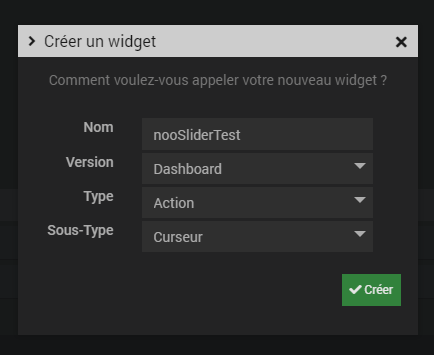
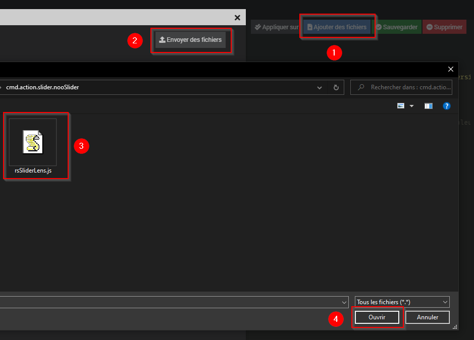

# Widget nooSlider

## A récupérer sous /jeedom_widgets/nooSlider/cmd.info.numeric.nooSlider.html

## Création du widget

Depuis le plugin Pimp My Jeedom :

- Depuis l'onglet 'Général', sélectionner le bouton 'Ajouter un Widget Tiers'
- Saisir le nom nooSlider, la version Dashboard, le type Action et le Sous-Type Curseur puis valider avec le bouton 'Créer'

- Dans la zone de texte 'Edition', coller le code du fichier cmd.info.numeric.nooSlider.html
- Sélectionner le bouton 'Ajouter des fichiers', puis 'Envoyer des fichiers', ajouter le fichier /cmd.info.numeric.nooSlider/rsSliderLens.js et fermer la fenêtre

- Sélectionner le bouton 'Sauvegarder'

## (facultatif) Création d'un virtuel avec commande info

- Si vous souhaitez associer le widget à une commande existante, cette étape n'est pas nécessaire
- Sinon, si vous souhaitez créer un nouveau circleProgress :
	- Créer un virtuel depuis le plugin Virtuel (Plugin -> Programmation -> Virtuel)
	- Dans ce virtuel, ajouter une commande info et de sous-type Numérique
		- Ce champ texte peut être modifié par scénario avec la commande event : la mise à jour de la valeur sera alors immédiate sur le design
	- Dans le virtuel, ajouter une commande action et de sous-type Curseur
  - Associer la commande info à cette commande action

## association du widget à la commande action

Depuis le plugin Pimp My Jeedom :

- Sélectionner le bouton 'Appliquer sur'
- Cocher les commandes de type Action souhaitées
- Enregistrer les commandes avec le bouton 'Valider'

- La liste des commandes associées au widget sont visibles dans la partie 'Commandes liées'
- Une prévisualisation basée sur le premier virtuel associé est visible

## (facultatif) Paramètres de la commande associée au widget

De nombreux paramètres sont possibles pour personnaliser les virtuels et obtenir des rendus très différents

			type : 'button'/'images', format d'affichage ('button' par défaut)
 			immediateChange : 0: prise en compte de la nouvelle valeur du changement à l'arrêt du défilement, 1: prise en compte de la nouvelle valeur immédiate à chaque changement (0 par défaut)
			paddingStart : décalage en % (0 à 1) à droite si slider gauche (0.1 par défaut, soit 10%)
 			paddingEnd : décalage à droite en % (0 à 1) si slider coupé (0.1 par défaut, soit 10%)

			// type button
			orientation : 'horizontale'/'verticale', affichage horizontal ou vertical ('horizontale' par défaut)
			width : largeur
			height : hauteur
			min : valeur minimale du slider (0 par défaut)
 			max : valeur maximale du slider (100 par défaut)
			step : pas de défilement (1 par défaut)
			minRange : valeur minimale accessible (valeur min par défaut)
 			maxRange : valeur maximale accessible (valeur max par défaut)
			fixedHandle : bouton de slider fixe, 0:non fixe / 1:fixe (0 par défaut)
			addPlus : 0:pas de '+' devant valeur positive / 1: '+' devant valeur positive (0 par défaut)
			cursorColor : couleur du curseur de position
			displayedValues : valeurs visibles sous slider (ex : '0,20,40,60,80,100')
			centerValue : valeur de la position séparant le slider pour définir les couleurs à gauche et droite (vide par défaut)
			rightColor = couleur à gauche du curseur de séparation ('red' par défaut)
 			leftColor = couleur à droite du curseur de séparation ('green' par défaut)
 			
			// type image
			images : liste des images à mettre en fond dans le mode image (ex: 'presence.png,presence_int.png,presence_no.png,presence_prog.png')
			imageWidth : hauteur de chaque image de fond pour le type image (60 par défaut)
			imageHeight : hauteur de chaque image pour le type image (40 par défaut)
			

## Ajout dans un Design

	- Depuis un Design, ajouter l'équipement ou le virtuel et suivez les étapes suivantes :
		- Clic droit, Sélectionnez 'Edition'
		- Clic droit, puis sélectionnez 'Ajouter équipement'
		- Sélectionner l'équipement souhaité
		- Sélectionner Valider
		- Rafraichir la page : le widget nooSlider est visible dans le Design
