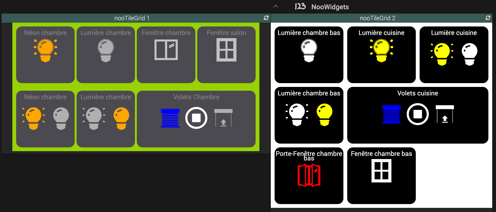

# Widget nooTileGrid 
Jeedom Community : https://community.jeedom.com/t/tuto-noodom-widget-nootilegrid/137877

## A récupérer sous /jeedom_widgets/nooTileGrid/cmd.info.string.nooTileGrid.html

## Création du widget

Depuis le plugin Pimp My Jeedom :

- Depuis l'onglet 'Général', sélectionner le bouton 'Ajouter un Widget Tiers'
- Saisir le nom nooTileGrid, la version Dashboard, le type Info et le Sous-Type Autre puis valider avec le bouton 'Créer'

- Dans la zone de texte 'Edition', coller le code du fichier cmd.info.string.nooTileGrid.html

- Sélectionner le bouton 'Sauvegarder'

## (facultatif) Création d'un virtuel avec commande info

- Si vous souhaitez associer le widget à une commande existante, cette étape n'est pas nécessaire
- Sinon, si vous souhaitez créer un nouveau nooTileGrid :
	- Créer un virtuel depuis le plugin Virtuel (Plugin -> Programmation -> Virtuel)
	- Dans ce virtuel, ajouter une commande info et de sous-type Autre

## association du widget à la commande info

Depuis le plugin Pimp My Jeedom :

- Sélectionner le bouton 'Appliquer sur'
- Cocher les commandes de type Infos souhaitées
- Enregistrer les commandes avec le bouton 'Valider'

- La liste des commandes associées au widget sont visibles dans la partie 'Commandes liées'
- Une prévisualisation basée sur le premier virtuel associé est visible

## (facultatif) Paramètres de la commande associée au widget

De nombreux paramètres sont possibles pour personnaliser les virtuels et obtenir des rendus très différents

    tilesList : liste des tuiles à afficher (au format json)
    gridWidth : largeur de la grille (ex: `650px`)
    gridHeight : hauteur de la grille (facultatif : calcul automatique)
    gridHorizontalSpace : espace entre les lignes de la grille (`10px`)
    gridVerticalSpace : espace entre les colonnes de la grille (`10px`)
    gridBackgroundColor : couleur de fond de la grille
    tileBackgroundColor : couleur de fond d'une tuile (`black`)
    tileLabelColor : couleur du libellé d'une tuile (`white`)
    tileWidth : largeur d'une tuile (`150px`)
    opening : css off|on pour les types génériques d'ouvertures
    light : `css off| css on` pour les types génériques de lumières
    flap : `css off| css on` pour les types génériques de volets
    openingOffIcon : `icone off` pour les types génériques ouvertures
    openingOnIcon : `icone on` pour les types génériques ouvertures
    openingOffColor : `icone off` pour les types génériques ouvertures
    openingOnColor : `icone on` pour les types génériques ouvertures
    lightOffIcon : `icone off` pour les types génériques lumières
    lightOnIcon : `icone on` pour les types génériques lumières
    lightOffColor : `icone off` pour les types génériques lumières
    lightOnColor : `icone on` pour les types génériques lumières
    flapOffIcon : `icone off` pour les types génériques volets
    flapOnIcon : `icone on` pour les types génériques volets
    flapOffColor : `icone off` pour les types génériques volets
    flapOnColor : `icone on` pour les types génériques volets
    flapLimit : limite pour considérer les volets en état on ou off (`5`)

## Ajout dans un Design

	- Depuis un Design, ajouter l'équipement ou le virtuel et suivez les étapes suivantes :
		- Clic droit, Sélectionnez 'Edition'
		- Clic droit, puis sélectionnez 'Ajouter équipement'
		- Sélectionner l'équipement souhaité
		- Sélectionner Valider
		- Rafraichir la page : le widget nooTileGrid est visible dans le Design
