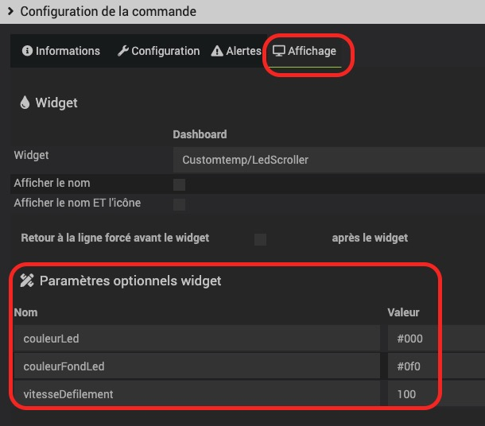
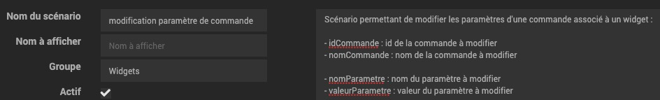
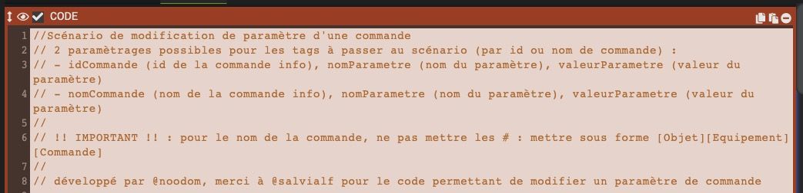
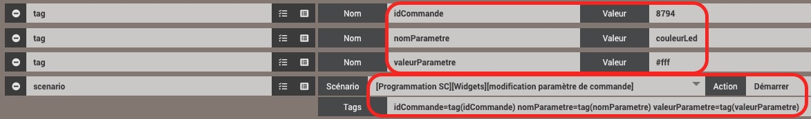
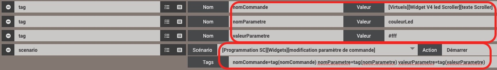
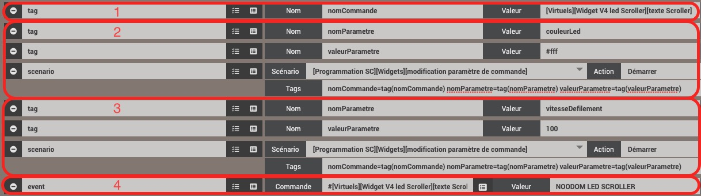

# scenarioModificationParametre

Scénario permettant la modification d'un paramètre de commande

## Paramètres optionnels

Les paramètres optionnels sont définis dans l'onglet **Affichage** de configuration de la commande (roue dentée)

 

## Code du scénario

Le contenu est accessible  dans le fichier **blocCodeModificationParametre.php** 

Ce contenu du scénario ayant pour nom **modification paramètre de commande** est à copier dans un bloc code.

 

 

## Appel du scénario

### Appel par id de commande

 

### Appel par nom de commande

 

>**IMPORTANT**
>
>Pour le nom de la commande, il ne faut retirer le caractère '#' en début de fin de commande dans le tag **nomCommande**

### Modification de plusieurs paramètres

- 1 : Nom de la commande
- 2 : Modification du paramètre 1 (**couleurLed=#fff**)
- 3 : Modification du paramètre 2 (**vitesseDefilement=100**)
- 4 : Modification du **texte** de Led Scroller

 

### Gestion des erreurs

En cas de problème de modification d'un paramètre, regarder les erreurs remontées dans les logs du scénario
